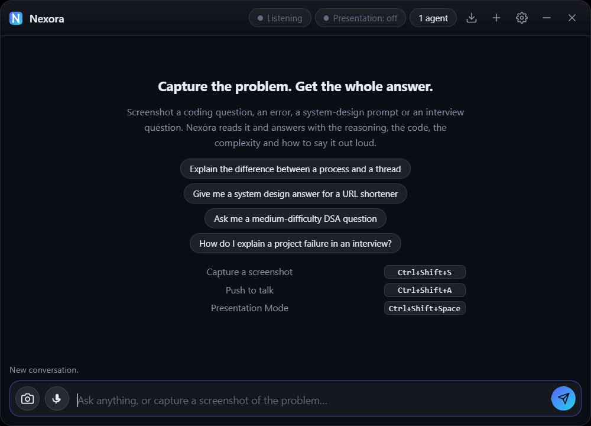
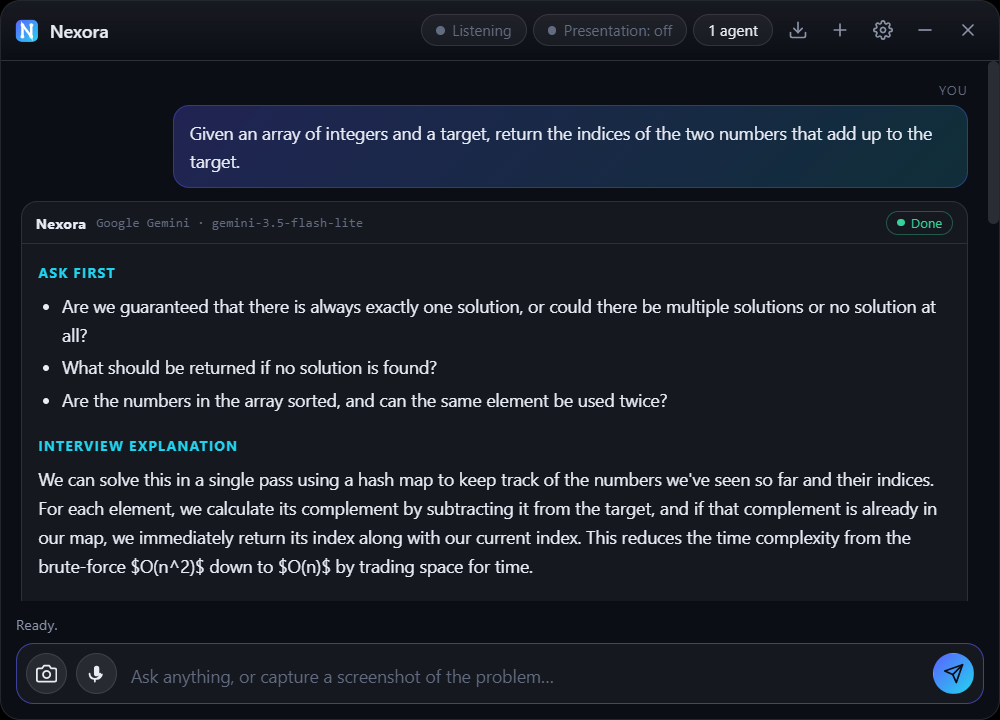
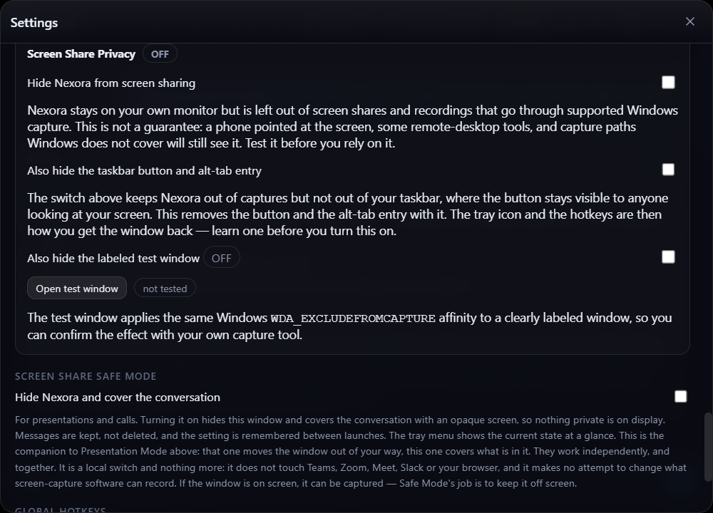

# Nexora AI

An always-on-top technical interview and problem-solving assistant. Screenshot a coding
question, an error, a system-design prompt or an interview question, and get back the
answer, the reasoning, working code, the complexity, and how to say it out loud.

Everything runs locally: audio, screenshots and text go straight from this app to the
provider you configured, using your own API key. There is no server in between.



Ask it something and the answer arrives in the shape an interview needs — the clarifying
questions to ask first, how to say the approach out loud, then the working code and the
complexity underneath.



Screen Share Privacy keeps the window off a screen share while leaving it on your monitor,
and says plainly what it cannot promise. There is a labeled test window so you can confirm
the effect with your own capture tool before trusting it.



---

## Quick start

```bash
npm install
npm start
```

Requires Node.js 18+. The first `npm install` downloads Electron (~100 MB).

On first launch the settings panel opens. Paste a key for **Google Gemini**, **OpenAI** or **Claude**
and you're running. Keys are encrypted with your OS keystore (Windows DPAPI / macOS
Keychain / libsecret) and stored in the app's user-data folder — never in this project
directory, so they can't be committed by accident.

| Provider | Get a key | Notes |
|---|---|---|
| Google Gemini | [aistudio.google.com/apikey](https://aistudio.google.com/apikey) | Free tier is generous; needs only a Google account |
| OpenAI | [platform.openai.com/api-keys](https://platform.openai.com/api-keys) | Pay-as-you-go; reasoning models run at a fixed temperature |
| Claude (Anthropic) | [console.anthropic.com/settings/keys](https://console.anthropic.com/settings/keys) | Pay-as-you-go; current models ignore temperature, and there is no speech-to-text |

Environment variables override stored keys, which is handy in development:

```powershell
$env:GEMINI_API_KEY = "AIza..."      # PowerShell
$env:OPENAI_API_KEY = "sk-..."
$env:ANTHROPIC_API_KEY = "sk-ant-..."
npm start
```

## Package a standalone app

```bash
npm run build:win     # NSIS installer in dist/
npm run build:mac
npm run build:linux
npm test              # 248 tests, node:test, nothing to install
npm run icons         # regenerate every icon from tools/make-icons.js
```

---

## The workflow

**Capture → analyse → answer → explain → suggest follow-ups.**

Press `Ctrl+Shift+S`. If you have more than one monitor, Nexora asks which one — with
live thumbnails, resolution and primary/secondary labels — rather than guessing. The
capture appears as a preview card you can send, recapture, discard, or ask a specific
question about. Follow-up questions keep the screenshot in context.

### Answers have a shape

The assistant classifies the question first and then follows the matching format, so a
Kubernetes question doesn't get forced through a LeetCode template.

| Kind | Sections |
|---|---|
| **Coding / DSA** | **Interview explanation** · Answer · Explanation · Code · How it works · Complexity · Edge cases and tests · Interviewer follow-ups |
| **System design** | **Interview explanation** · Answer · Requirements · Assumptions · Architecture · Components · Data model and flow · Scaling · Reliability · Trade-offs · Follow-ups |
| **Conceptual** | **Interview explanation** · Answer · Explanation · In practice · Related follow-ups |
| **Debugging** | **Interview explanation** · Answer · Why this happens · Fix · How to verify · In production |
| **Behavioural** | **Saying it well** · Answer · STAR · Likely follow-ups |

Every format *opens* with the part you say out loud, because you are usually reading it
mid-call with someone waiting. It streams first, so it is on screen before the code is.
Everything under it is reference you scroll to afterwards.

### Follow-up suggestions

After each answer, four suggestions appear, generated from that specific question and
answer — "Explain why the two-pointer scan is O(n) not O(n²)", not "Tell me more".
Clicking one sends it immediately. They run on the provider's cheapest model, in
parallel with everything else, so they cost you no waiting.

### Two-agent mode

Toggle it from the header chip or the tray. Agent 1 solves the problem. Agent 2 solves
it *independently* — it is told not to read Agent 1's answer as a starting point, and to
prefer a genuinely different approach — then reviews Agent 1 for bugs, wrong complexity
and missed edge cases. A **Combined insight** pane then gives a verdict, what they agree
on, where they differ, and what to watch out for.

Point the two agents at different providers for the most useful second opinion.

Both agents start in the same tick, so the first answer arrives no later than it would
with one agent. The comparison starts the moment both finish; suggestions start as soon
as Agent 1 finishes, without waiting for Agent 2.

---

## Configuration

Settings → each agent has its own **provider**, **model** and **temperature**. Models
you type by hand are kept: new model ids ship faster than any bundled catalogue, and
rejecting them would age badly. Reasoning models (`gpt-5`, `o4-mini`, …) disable the
temperature slider, because they reject a custom temperature outright.

Also configurable: voice provider and transcription model, whether to always ask which
display to capture, conversation memory depth, window opacity, always-on-top, start
hidden, and your profile.

### Your profile (résumé & projects)

Paste your résumé and project write-ups, or import a `.txt`/`.md`. It's saved to
`profile.json` in the app's data folder — not in this repo — and sent with each request
as clearly fenced reference material, so behavioural answers draw on your real
experience instead of generic filler.

The instruction wrapped around your profile tells the model to ground answers in it,
never to invent experience, employers, dates or metrics that aren't written there, and
to treat the whole block as data rather than as instructions — so a job description you
paste in can't quietly redirect the assistant.

---

## Voice input

Hold `Ctrl+Shift+A`, speak, press it again. The recording is conditioned before it is
uploaded, because raw microphone float is a poor thing to hand a speech model.

Capture runs on the **audio thread** through an AudioWorklet. The previous
`ScriptProcessorNode` ran on the main thread, competing with streaming markdown and
layout, and dropped buffers whenever the UI was busy — a recording full of holes is a large
part of why transcripts came back empty.

Each clip then goes through `audio-dsp.js`:

| Step | Why |
|---|---|
| DC offset removal | A biased signal wastes headroom when normalising |
| Voice activity detection | Energy **and** zero-crossing rate, thresholded against the measured noise floor — so a door slam is not a word, and a quiet room adapts |
| Trim to the speech | A ten-second clip with two seconds of talking is mostly silence |
| Resample to 16 kHz | Through a 4th-order Butterworth low-pass, so nothing above the new Nyquist aliases down as a tone nobody spoke |
| Normalise | Speech at 3% of full scale — ordinary for a laptop mic — nearly vanishes in 16-bit PCM |

If the detector finds no speech, **nothing is uploaded**. You get "I heard nothing at all"
or "that was too quiet" immediately, instead of paying for a round trip to be told the same
thing less usefully.

If a model *does* return one of its no-speech markers (`<noise>`, `[inaudible]`,
`(silence)`) on a clip that demonstrably contained speech, Nexora retries once with a
stronger model. Those markers are never sent on as your question — which is what used to
happen, and is how an assistant ends up answering `<noise>`.

Settings → **Voice input** picks the microphone and the transcription model, and
**Test microphone** records two seconds and reports peak level, SNR and whether speech was
detected, using the same pipeline the real path uses. Every recording also logs one
diagnostic line to the console:

```
[nexora] mic capture=audioWorklet rate=48000 raw=2304ms sent=1180ms trimmed=1124ms
         peak=0.046 floor=0.0030 snr=3.1dB speech=true
```

There is deliberately no WASM voice detector here. A model-based one (Silero and friends)
would need `wasm-unsafe-eval` in the page's CSP, and the page is locked to
`script-src 'self'` on purpose. Energy-plus-zero-crossing detection is well understood,
costs microseconds, and is covered by tests against synthesised speech, room tone, clicks
and silence.

---

## Presentation Mode

For your own presentation workflow. Press `Ctrl+Shift+Space`, or use the tray, and Nexora
hides its window and takes it out of the taskbar and alt-tab. Press it again and the window
comes back at exactly the position and size it had.

The process never stops. Your conversation, the screenshot you were working on and every
other bit of state are still in memory, the tray icon still works, and `Show Assistant`
brings the window back at any time without ending the mode — the header says which modes
are still on.

Screenshots and push-to-talk keep working while it is on, and they stop pulling the window
forward: capture a slide mid-presentation and the preview is simply waiting in the composer
when you come back.

Settings → **Presentation Mode** covers the toggle, the global shortcut (click **Change**
and press the combination you want — one another app already owns is rejected rather than
silently ignored), and automatic entry.

**Automatically enter Presentation Mode** — off by default, Windows only. It asks Windows
`SHQueryUserNotificationState`, the same signal the OS uses to decide whether a notification
would interrupt you, and reports when a full-screen app or presentation is running. It reads
that one flag and nothing else: it cannot tell which application you are in, and it conceals
nothing from anyone. Nexora only turns the mode back off if it was the one that turned it on
— a mode you enabled by hand stays enabled. Polling runs in a single background helper that
is only started when you switch this on.

**What it does not do**, deliberately: it never touches Teams, Zoom, Meet, Slack, your
browser or any other application, and it never calls, hooks or alters a screen-capture API.
It does not try to be invisible to screen sharing — it simply is not on screen.

### Presentation Mode and Safe Mode

Two different jobs, and they work together:

| | Presentation Mode | Screen Share Safe Mode |
|---|---|---|
| Concerned with | the **window** | the **content** |
| Turning it on | hides it, off the taskbar | hides it, covers the conversation |
| If you summon the window | it comes back, mode still on | it comes back **covered** |
| Turning it off | restores exact position and size | uncovers the conversation |
| Shortcut | `Ctrl+Shift+Space`, configurable | tray and settings |

## Screen Share Safe Mode

For the moment you realise you're about to share your screen. Turn it on from the **tray
menu** or Settings and Nexora hides its window and covers the conversation with an opaque
screen. Nothing is deleted — the thread comes straight back when you turn it off — and
the setting is remembered between launches, so a session that starts in Safe Mode never
paints the conversation at all. A push-to-talk recording in progress is discarded rather
than left running behind the cover.

The tray tells you where you stand without opening anything: the menu's first line reads
`● Screen Share Safe Mode: ON` or `○ Screen Share Safe Mode: OFF`, the checkbox below it
matches, and the icon's tooltip says the same.

`Ctrl+Shift+Space` still hides and shows the window in both modes — it is the fast
reflex, Safe Mode is the one that sticks. If the window is summoned while Safe Mode is
on, the cover is still there, and it sits above the settings sheet too, since that panel
holds your profile and key hints.

**What it does not do**, deliberately:

- It never touches Teams, Zoom, Meet, Slack, your browser or any other application.
- It never calls, hooks or alters a screen-capture API, and it does not enable Electron's
  content protection. Safe Mode does not make this window invisible to capture software —
  it keeps the window off screen so there is nothing to capture. Those are different
  claims, and only the second one is true here.

It hides your own window, not the taskbar button or alt-tab entry, which stay
deliberately visible.

## Screen Share Privacy

Settings -> **Screen Share Privacy** -> *Hide Nexora from screen sharing*. Nexora stays on
your monitor and is left out of screen shares and recordings that go through supported
Windows capture. This is the one feature in the app that actually hides it from other
people, so it behaves accordingly:

- **Off by default**, and never switched on by an upgrade.
- Applied **before the window is first shown**, so there is no frame where it is visible.
- It has its own IPC channel and is **not reachable from a generic settings patch**, and
  neither Safe Mode nor Presentation Mode may touch it.
- The switch shows what is **actually true**, not what was requested: if the call fails it
  reads OFF, because a privacy control that claims protection it does not have is worse
  than one that does nothing.

**What it is not.** It is not a guarantee of invisibility. It covers supported Windows
capture paths only; a phone pointed at your screen, some remote-desktop tools, hardware
capture and unsupported paths still see the window. Test it with your own capture tool
before relying on it — the labeled test window below exists for exactly that.

## Screen Capture Privacy Demonstration

Settings → **Screen Capture Privacy** opens a clearly labeled **NEXORA CAPTURE PRIVACY
TEST WINDOW** containing sample text, shapes and controls. The window remains visible to
the local user. Turning the setting **ON** applies Windows content protection to that test
window only, which on Windows 10 version 2004 and later is the official
`SetWindowDisplayAffinity()` API with `WDA_EXCLUDEFROMCAPTURE`; turning it **OFF** restores
`WDA_NONE` (normal capture behavior). The diagnostic page in the test window shows the
Windows version, native HWND, current affinity, API result and the last error.

The call is made by Electron from inside the app process, in `screen-capture-privacy.js`.
That module is the only place allowed to name these APIs, and `source-hygiene.test.js`
fails the build if any other file does — Nexora never hides its own window from capture,
and the test is what keeps that true.

### Why this is not a separate helper process

An earlier version of this feature shelled out to a small native `.exe` that called
`SetWindowDisplayAffinity()` itself. That approach cannot work, and it is worth recording
so nobody rebuilds it: **Windows only permits a process to set display affinity on its own
windows.** A helper process asking for affinity on a window owned by Nexora gets
`ERROR_ACCESS_DENIED` (5) every time, no matter how it is built or which user runs it. The
same call from inside the owning process succeeds. Unit tests did not catch this because
they mocked the helper invocation, so the cross-process call was never actually made.

### Windows build and run

There is no native build step — the feature is plain Electron. From PowerShell on Windows:

```powershell
npm install
npm test
npm start
```

To build the installer, use `npm run build:win`. The CI workflow runs the same test and
installer commands.

### Manual verification

1. Start Nexora on Windows and open Settings → **Screen Capture Privacy**.
2. Click **Open test window**, confirm the labeled window is visible locally, then turn
  privacy **ON** either in Settings or inside the test window.
3. Use a normal supported Windows capture test, such as Snipping Tool or Xbox Game Bar,
  and capture the display containing the test window. The test window should be absent
  from the resulting capture while remaining visible on the physical monitor.
4. Check the diagnostic fields for `WDA_EXCLUDEFROMCAPTURE`, a successful API result and
  the test window HWND. Turn privacy **OFF**, capture again, and confirm the window is
  included normally.

`WDA_EXCLUDEFROMCAPTURE` only affects supported Windows screen-capture mechanisms. It is
not a guarantee for every screen-sharing, recording, camera, remote-desktop or other
capture technology. Older Windows versions, unsupported capture paths, policy settings,
or a missing helper may reject the call; Nexora reports the failure and continues running.
The feature does not hide processes, inject code, overlay other applications, persist
stealthily, or bypass security and monitoring software.

---

## Hotkeys

| Action | Keys |
|---|---|
| Presentation Mode on / off | `Ctrl+Shift+Space` (configurable) |
| Push to talk | `Ctrl+Shift+A` |
| Capture a screenshot | `Ctrl+Shift+S` |
| Toggle click-through | `Ctrl+Shift+X` |

Plain show/hide lives on the tray icon — click it, or use `Show Assistant` in its menu.
Held keys are debounced, so one long press is one toggle rather than a dozen.

A hotkey another application already owns is reported in the console and skipped; you
lose that hotkey and nothing else.

---

## Architecture

```
main.js              Electron main — windows, tray, IPC, credentials, orchestration
preload.js           The only renderer↔main bridge; enumerates exactly what the UI may do
renderer.js          UI, screenshot flow, mic capture, markdown, conversation state
index.html           Layout and styling

providers/           AI provider abstraction
  index.js             registry: getProvider, fastModel, listProviders
  shared.js            SSE reading, retry/backoff, ProviderError, image trimming
  gemini.js            Google Gemini
  openai.js            OpenAI
  anthropic.js         Claude, via the official Anthropic SDK
agents.js            One or two agents, concurrently, plus synthesis and follow-ups
prompts.js           Every instruction sent to a model, and suggestion parsing
displays.js          Monitor enumeration, per-display capture, image encoding
credentials.js       Per-provider key storage over safeStorage
settings-schema.js   Defaults, migration from older builds, normalisation
audio-dsp.js         Speech conditioning: DC removal, VAD, trim, resample, normalise, WAV
audio-worklet.js     Microphone capture on the audio thread
safe-mode.js         Screen Share Safe Mode state machine
presentation-mode.js Presentation Mode — hide, leave the taskbar, restore geometry
presentation-watch.js Optional Windows full-screen detection (opt-in, one helper process)
tray-menu.js         The tray menu as a pure state-in/template-out function
hotkeys.js           Accelerators and registration
tray-icon.js         Generated — embedded tray icon
tools/make-icons.js  Generates icon.png / .ico / .icns / favicon / tray-icon.js
test/                node:test suites
```

### Adding a provider

Write one module exposing `{ id, label, keyEnv, keyUrl, keyHint, models,
transcribeModels, defaults, supports, stream(), complete(), transcribe() }` and add it to
the array in `providers/index.js`. Nothing above that layer knows a vendor name.

The neutral message format everything else speaks:

```js
{ role: 'user' | 'assistant',
  parts: [ { type: 'text', text }, { type: 'image', mime, data /* base64 */ } ] }
```

Claude is the one provider that does not hand-roll its HTTP. It uses `@anthropic-ai/sdk`,
the app's only runtime dependency, because that SDK owns the streaming event shapes, beta
flags and error taxonomy that are easy to get subtly wrong by hand. It still accepts an
injected `fetch`, so it is tested through exactly the same seam as the other two. Three
Claude-specific behaviours are worth knowing: current models reject `temperature`
outright, thinking is left unconfigured on purpose (omitting it runs adaptive thinking on
the models that have it), and a request can return HTTP 200 with `stop_reason: "refusal"`,
which the provider turns into a readable error instead of an empty answer. Anthropic has
no speech-to-text, so it is filtered out of the voice provider list rather than offered
and then failing.

Each provider translates that into its own wire format — Gemini's `inline_data`, OpenAI's
`image_url` data URIs — and translates its errors back into a `ProviderError` carrying a
`code` the UI can branch on.

### Design notes

- **No API key ever enters the renderer.** Every network call happens in the main
  process; the UI only sees text coming back. The preload bridge whitelists a fixed set
  of channels, `contextIsolation` is on and `nodeIntegration` is off. The bridge can save,
  clear and describe a key — there is no channel that returns one.
- **A strict CSP** on the page blocks remote scripts and remote images entirely.
- **Model output is escaped before markdown rendering**, so a response can't inject HTML.
- **Screenshots are treated as data, not instructions.** The model is told to ignore
  anything in a capture that reads like a command addressed to it.
- **Only the newest screenshot is resent** with follow-ups. Older captures are dropped:
  once a screenshot has been described, the answer text carries the context, and
  resending megabytes of PNG buys nothing but latency.
- **PNG unless it's big.** Screenshots of code have to stay crisp, so captures stay PNG
  and only fall back to JPEG past ~1.1 MB.
- **The window is visible** in the taskbar and in alt-tab, always. It is also visible in
  screen shares unless you turn on **Screen Share Privacy**, which is off by default, never
  switched on by an upgrade, and cannot be flipped by a generic settings patch. Safe Mode
  and Presentation Mode still do not conceal anything: one covers the conversation, the
  other takes the window off the screen, and `source-hygiene.test.js` holds them to it.

---

## Tests

```bash
npm test
```

248 tests on `node:test` with no dependencies. Providers, prompts, agent orchestration,
displays, credentials, settings migration, Safe Mode, hotkeys and the tray menu are all
free of Electron imports specifically so they run in plain Node.

Beyond unit coverage, the suite also checks things that are otherwise invisible until
someone installs a build: every module reachable from `main.js` is listed in
`build.files`, every channel the preload invokes has a handler in main, every channel
main sends has a slot on the inbound allowlist, and no source file contains an invisible
control character.

---

## Troubleshooting

**Nothing happens when I run `npm start` in VS Code's terminal** — VS Code's extension
host exports `ELECTRON_RUN_AS_NODE=1`, which makes Electron run as plain Node, so
`require('electron')` returns a path string and startup fails. Clear it first:

```powershell
[Environment]::SetEnvironmentVariable('ELECTRON_RUN_AS_NODE', $null)
npm start
```

**`npm run build:win` fails extracting winCodeSign** — `Cannot create symbolic link: A
required privilege is not held by the client`. electron-builder's signing bundle contains
macOS symlinks Windows won't create unelevated. Turn on Windows **Developer Mode**
(Settings → System → For developers), or run the build from an elevated terminal.

**"Microphone unavailable"** — Windows Settings → Privacy & security → Microphone → allow
desktop apps. On macOS, System Settings → Privacy & Security → Microphone.

**Screenshot is blank, or the display picker has no thumbnails** — on macOS, grant Screen
Recording permission and restart. The picker still works from the text descriptions.

**A hotkey does nothing** — another app has claimed it. The console prints which one;
change the accelerator in `hotkeys.js`.

**"Model not available on your key"** — that model isn't on your tier. Pick another in
Settings; `gemini-3.5-flash-lite` and `gpt-4o-mini` are the safest fallbacks.

**Rate limited on Gemini** — free-tier quotas are counted per model, so a 429 often clears
the moment you switch models. Short waits are absorbed automatically; a long suggested
delay means a daily quota, so it fails fast and names the quota instead of hanging.

---

## Upgrading from ANGEL

This app was previously called ANGEL. Renaming it moved its user-data folder, so on first
launch Nexora carries over the old `settings.json`, `profile.json` and your saved API key,
and migrates the settings shape — your model choice, temperature and edited prompt all
survive. The old folder is left untouched.

The `Local State` file is copied along with the key, and that part is not optional:
Chromium's OSCrypt keeps its master key there, so copying the encrypted key without it
would leave the ciphertext permanently unreadable.

## License

MIT.
